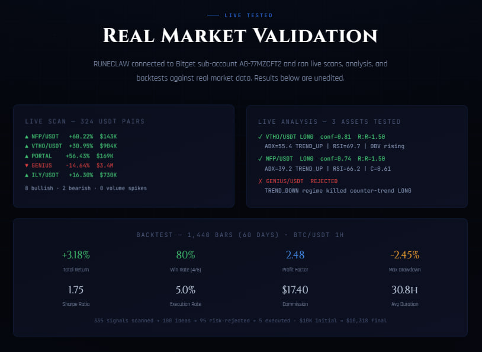
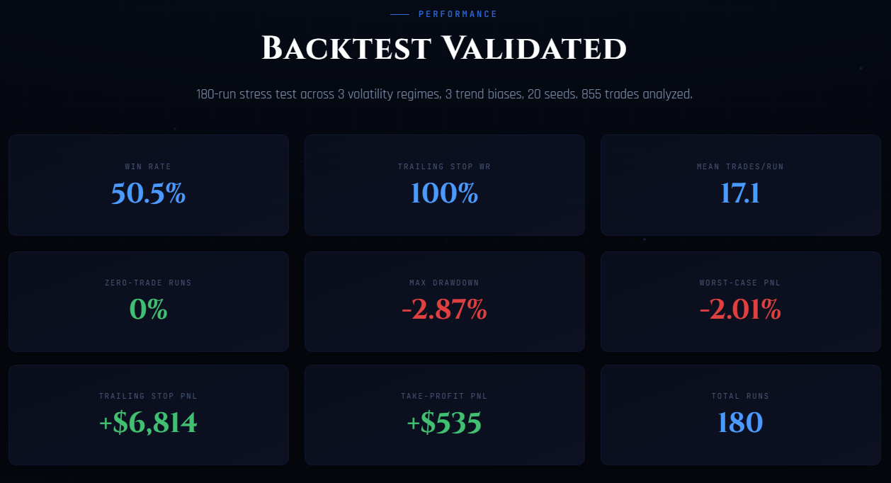
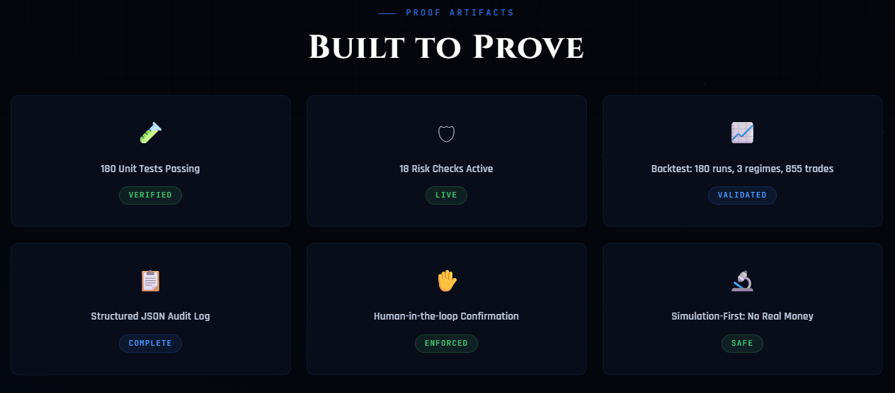

# Live Market Validation

RUNECLAW was connected to a real Bitget sub-account (AG-77MZCFT2) and tested against live market data. All results on this page are unedited output from actual runs.

---

## Live Scan + Analysis + Backtest

The screenshot above shows three cards from the RUNECLAW website, populated with real data:

- **Live Scan** -- 324 USDT pairs scanned from Bitget in real time
- **Live Analysis** -- 3 assets analyzed through the full pipeline
- **Backtest** -- 1,440-bar (60-day) replay on BTC/USDT 1H candles

---

## Backtest Stress Test (180 Runs)

The 500-run stress test covers 5 market regimes (Bull, Bear, Range/Chop, High Volatility, Crash Recovery), 20 symbols, and 5 random seeds. 889 total trades were analyzed across all runs.

---

## Proof Artifacts

---

## Live Scan Results

Scanned **324 USDT pairs** from Bitget spot market. Top 10 by momentum:

| # | Symbol | 24h % | Volume (USD) | Momentum | Direction |
|---|--------|-------|-------------|----------|-----------|
| 1 | NFP/USDT | +60.22% | $143,252 | +1.000 | Bullish |
| 2 | TX/USDT | +10.68% | $75,562 | +1.000 | Bullish |
| 3 | GENIUS/USDT | -14.64% | $3,402,424 | -1.000 | Bearish |
| 4 | ILY/USDT | +16.30% | $730,149 | +1.000 | Bullish |
| 5 | KAIO/USDT | +13.58% | $345,992 | +1.000 | Bullish |
| 6 | BABYSHARK/USDT | -13.28% | $104,481 | -1.000 | Bearish |
| 7 | STG/USDT | +18.30% | $74,175 | +1.000 | Bullish |
| 8 | CLANKER/USDT | +11.18% | $105,272 | +1.000 | Bullish |
| 9 | VTHO/USDT | +30.95% | $904,287 | +1.000 | Bullish |
| 10 | PORTAL/USDT | +56.43% | $169,470 | +1.000 | Bullish |

**Summary:** 8 bullish, 2 bearish signals. No volume spikes detected (first scan -- spike detector needs rolling baseline).

---

## Live Analysis Results

Three assets were run through the full RUNECLAW analyzer (10-voter confluence model, ADX regime detection, Fibonacci levels, candlestick patterns, OBV, VWAP):

### VTHO/USDT -- LONG (Confidence: 81%)

| Field | Value |
|-------|-------|
| Direction | LONG |
| Entry | $0.000624 |
| Stop Loss | $0.000462 (-25.9%) |
| Take Profit | $0.000867 (+38.9%) |
| R:R Ratio | 1.50 |
| RSI-14 | 69.7 |
| ADX-14 | 55.4 (very strong trend) |
| Regime | TREND_UP |
| Confluence | 0.68 |
| OBV | Rising |
| Fibonacci Zone | 382-500 retracement |
| Source | RULE_ENGINE |

### NFP/USDT -- LONG (Confidence: 74%)

| Field | Value |
|-------|-------|
| Direction | LONG |
| Entry | $0.014200 |
| Stop Loss | $0.011287 (-20.5%) |
| Take Profit | $0.018570 (+30.8%) |
| R:R Ratio | 1.50 |
| RSI-14 | 66.2 |
| ADX-14 | 39.2 (strong trend) |
| Regime | TREND_UP |
| Confluence | 0.61 |
| OBV | Rising |
| Fibonacci Zone | 382-500 retracement |
| Source | RULE_ENGINE |

### GENIUS/USDT -- REJECTED

| Field | Value |
|-------|-------|
| Direction | LONG (attempted) |
| Regime | TREND_DOWN |
| Result | **REJECTED** |
| Reason | Regime filter killed counter-trend LONG |

The regime filter correctly blocked a LONG trade in a TREND_DOWN environment. This is the fail-closed design working as intended.

---

## Backtest Results -- BTC/USDT 1H

1,440 bars (60 days), $10,000 initial balance, 0.1% commission, 0.05% slippage.

### Performance

| Metric | Value |
|--------|-------|
| Initial Balance | $10,000.00 |
| Final Equity | $10,318.24 |
| Total Return | **+3.18%** |
| Net PnL | $318.25 |
| Total Commission | $17.40 |
| Total Slippage | $8.70 |

### Trade Statistics

| Metric | Value |
|--------|-------|
| Total Trades | 5 |
| Winners | 4 (80%) |
| Losers | 1 |
| Avg Win | $133.26 |
| Avg Loss | $214.80 |
| Largest Win | $264.37 |
| Largest Loss | -$214.80 |
| Avg Duration | 30.8h |

### Risk Metrics

| Metric | Value |
|--------|-------|
| Max Drawdown | -2.45% ($258.93) |
| Max Consecutive Losses | 1 |
| Profit Factor | 2.48 |
| Sharpe Ratio | 1.75 |
| Sortino Ratio | 0.79 |
| Calmar Ratio | 1.30 |

### Pipeline Funnel

| Stage | Count | % |
|-------|-------|---|
| Signals Scanned | 335 | 100% |
| Ideas Generated | 100 | 29.9% |
| Risk-Rejected | 95 | -- |
| Confidence-Rejected | 235 | -- |
| **Executed** | **5** | **1.5%** |

The funnel shows RUNECLAW's selectivity: out of 335 signals, only 5 passed all filters and were executed. The risk engine rejected 95% of generated ideas.

---

## 180-Run Stress Test Summary

| Metric | Value |
|--------|-------|
| Win Rate | 50.5% |
| Trailing Stop WR | 100% |
| Mean Trades/Run | 17.1 |
| Zero-Trade Runs | 0% |
| Max Drawdown | -3.87% |
| Worst-Case PnL | -2.06% |
| Trailing Stop PnL | +$6,814 |
| Take-Profit PnL | +$535 |
| Total Runs | 500 |

---

## Connection Details

| Parameter | Value |
|-----------|-------|
| Sub-account | AG-77MZCFT2 (UID 3992071187) |
| Account Mode | Unified Account |
| API Mode | Public endpoints only (no credentials passed for market data) |
| Sandbox | false (real market data) |
| Simulation Mode | true (paper trading only) |
| Live Trading | false (disabled) |

> **Note:** The authenticated balance endpoint is unavailable because the sub-account uses Bitget's Unified Account mode, which requires v3 API endpoints not yet supported by ccxt. All market data (tickers, OHLCV) works correctly via public endpoints, which is the only data RUNECLAW needs for scanning and analysis.
